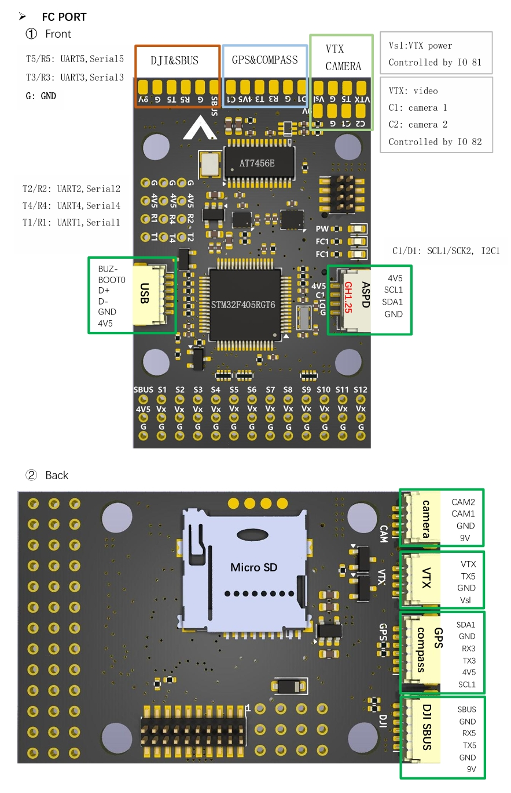

# LongBowF405WING Flight Controller

The LongBowF405WING is a flight controller produced by [lefei rc](http://www.lefeirc.com/).

## Features
    Processor
        STM32F405 168Mhz, 1MB 32-bit processor
        AT7456E OSD
    Sensors
        ICM42688P Acc/Gyro
        SPL006 barometer
    Power
        2S - 6S Lipo input voltage with voltage monitoring
        120A Cont., 215A peak current monitor
        9V/12/5V, 1.8A BEC for powering Video Transmitter controlled by GPIO
        4.9V/6V/7.2V, 6A BEC for servos
        5V, 2.4A BEC for internal and peripherals
    Interfaces
        12x PWM outputs DShot capable (Serail LED output is PWM12)
        1x RC input
        5x UARTs/serial for GPS and other peripherals, 6th UART internally tied to Wireless board)
        I2C port for external compass, airspeed, etc.
        microSDCard for logging, etc.
        USB-C port
  
## Pinout

## Wiring Diagram

## PDB

## UART Mapping

The UARTs are marked Rn and Tn in the above pinouts. The Rn pin is the
receive pin for UARTn. The Tn pin is the transmit pin for UARTn.

 - SERIAL0 -> USB
 - SERIAL1 -> USART1 (User) (DMA capable)
 - SERIAL2 -> USART2 (RX tied to inverted SBUS RC input, but can be used as normal UART if :ref:`BRD_ALT_CONFIG<>` =1) 
 - SERIAL3 -> UART3 (GPS) (TX DMA capable)
 - SERIAL4 -> UART4 (User) (TX DMA capable)
 - SERIAL5 -> UART5 (User, available on DJI air unit connector) (TX DMA capable)
 - SERIAL6 -> UART6 (tied to internal wireless module, MAVLink2 telem) 

## RC Input

RC input is configured on the SBUS pin (inverted and sent to UART2_RX). It supports all RC
protocols except serial protocols such as CRSF, ELRS, etc. Those devices can be connected to USART1 TX and RX, instead.
Fport can be connected to USART1 TX also, but will require an external bi-directional inverter and the ref:`SERIAL1_OPTION<SERIAL1_OPTION>' = 4 (HalfDuplex) set.
   
## OSD Support

The LongBowF405WING supports using its internal OSD using OSD_TYPE 1 (MAX7456 driver). External OSD support such as DJI or DisplayPort is supported using UART5 or any other free UART5. See :ref:`common-msp-osd-overview-4.2` for more info.

## PWM Output

The LongBowF405WING supports up to 12 PWM outputs . 
All outputs support DShot.

The PWM is in 5 groups:

 - PWM 1,2 in group1
 - PWM 3,4 in group2
 - PWM 5-6 in group3
 - PWM 7-9 in group4
 - PWM 10-12 in group5 

Channels within the same group need to use the same output rate. If
any channel in a group uses DShot then all channels in that group would need
to use DShot.

## Battery Monitoring

The board has a builting voltage and current sensor. The current
sensor can read up to 120A continuosly, 160 Amps peak. The voltage sensor can handle up to 6S
LiPo batteries.

The correct battery setting parameters are set by default and are:

 - BATT_MONITOR 4
 - BATT_VOLT_PIN 10
 - BATT_CURR_PIN 11
 - BATT_VOLT_MULT 11.5
 - BATT_AMP_PERVLT 50

## Compass

The LongBowF405WING does not have a built-in compass, but you can attach an external compass using I2C on the SDA and SCL pads.

## VTX power control

GPIO 81 controls the VTX BEC output to pins marked "9V". Setting this GPIO high removes voltage supply to pins.

## Loading Firmware
Firmware for these boards can be found at https://firmware.ardupilot.org in sub-folders labeled LongBowF405WING.

Initial firmware load can be done with DFU by plugging in USB with the
boot button pressed. Then you should load the "LongBowF405WING_bl.hex"
firmware, using your favourite DFU loading tool.

Subsequently, you can update firmware with Mission Planner.

